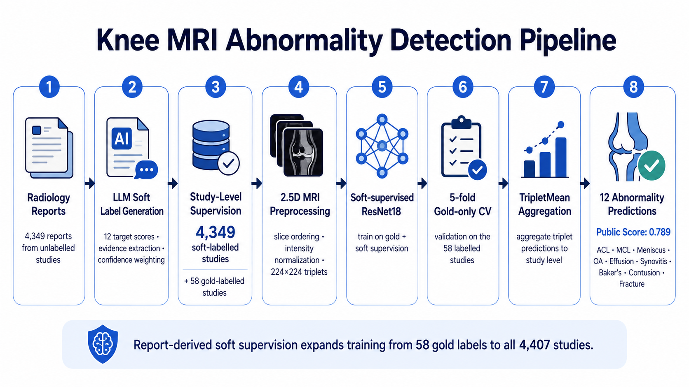

# Knee MRI Abnormality Detection


Soft-supervised multi-label knee MRI abnormality detection using **radiology-report-derived soft labels**, **2.5D DICOM inputs**, and a **ResNet18 backbone** for prediction across **12 clinical targets**.

This project was developed for the **RSNA Knee MRI Abnormality Detection** Kaggle competition.  
The current soft-supervised pipeline achieved a **0.789 public leaderboard score**.

---

## Pipeline



---

## Project Overview

A major challenge in this competition is that only **58 studies** have gold labels, while the full training set contains **4,407 studies**.  
To address this, I expanded supervision beyond the small labelled subset by extracting **soft labels from radiology reports** for the remaining **4,349 studies**.

The final pipeline uses:

- **LLM-based report labeling** to generate soft target scores
- **Study-level soft supervision** over the full dataset
- **2.5D MRI preprocessing** using previous / centre / next slices
- **Soft-supervised ResNet18 training**
- **5-fold gold-only cross-validation**
- **TripletMean aggregation** for study-level prediction

This approach allows training on all available studies while preserving reliable evaluation on the gold-labelled subset.

---

## Clinical Targets

The model predicts 12 abnormalities:

- ACL
- MCL
- Medial Meniscus
- Lateral Meniscus
- Medial OA
- Lateral OA
- PF OA
- Effusion
- Synovitis
- Baker's cyst
- Contusion
- Fracture

---

## Method

### 1. LLM Soft Label Generation
Radiology reports are parsed into **12 target-specific soft labels** rather than hard binary labels.

For each target, the labeling pipeline extracts:

- abnormality score
- confidence
- supporting evidence

This provides soft supervision for the previously unlabelled studies.

### 2. Study-Level Supervision
The dataset consists of:

- **58 gold-labelled studies**
- **4,349 report-derived soft-labelled studies**

Together, this expands supervision to the full **4,407-study** training set.

### 3. 2.5D MRI Preprocessing
Each MRI sample is converted into a **2.5D triplet**:

- previous slice
- centre slice
- next slice

Preprocessing includes:

- slice ordering
- intensity normalization
- resize / crop to model input size
- triplet construction for model training

### 4. Soft-supervised Training
A **ResNet18** backbone is trained using:

- gold labels for the 58 labelled studies
- soft labels for the report-derived studies
- pseudo-label weighting / confidence weighting
- multi-target supervision across all 12 abnormalities

### 5. Gold-only 5-Fold Cross-Validation
Because only the 58 gold-labelled studies provide reliable ground truth, model validation is performed using:

- **5-fold CV on gold-labelled studies only**

This gives a more trustworthy estimate of model quality than validating on pseudo-labelled data.

### 6. TripletMean Aggregation
Predictions are first made at the triplet level, then aggregated to the study level using **TripletMean aggregation**.

This converts multiple slice-level predictions into final **study-level abnormality predictions**.

---

## Notebook Flow

The repository is organised around the following workflow:

1. `01_llm_soft_labels.ipynb`  
   Build the report-to-soft-label pipeline.

2. `02_soft_label_production.ipynb`  
   Generate soft labels for the full unlabelled dataset.

3. `03_gold_5fold_cv.ipynb`  
   Prepare and evaluate gold-only 5-fold cross-validation.

4. `04_soft_supervised_training.ipynb`  
   Train the soft-supervised 2.5D ResNet18 model.

5. `05_inference_submission.ipynb`  
   Run final inference and prepare Kaggle submission.

---

## Results

### Current Main Result
- **Public Kaggle Score:** `0.789`

### Key Improvement
The main improvement came from replacing the earlier limited-label setup with **report-derived soft supervision**, which expanded usable supervision from **58 studies** to **all 4,407 studies**.

---

## Repository Contents

```text
.
├── 01_llm_soft_labels.ipynb
├── 02_soft_label_production.ipynb
├── 03_gold_5fold_cv.ipynb
├── 04_soft_supervised_training.ipynb
├── 05_inference_submission.ipynb
├── figurespipeline.png
├── requirements.txt
├── README.md
└── LICENSE
